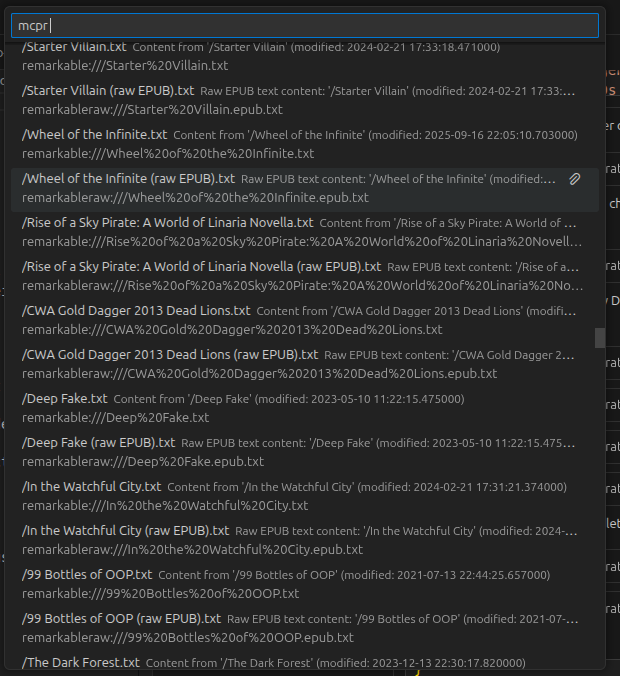
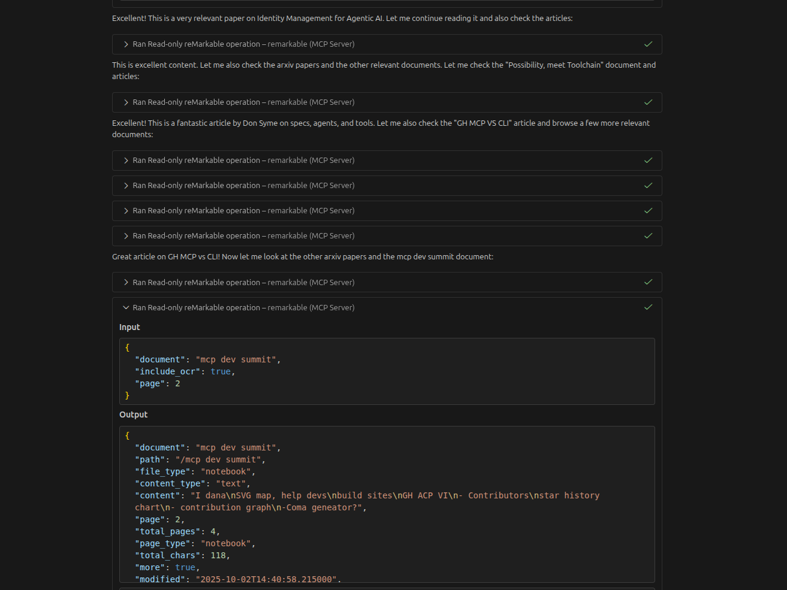

# reMarkable MCP Server

Unlock the full potential of your reMarkable tablet as a **second brain** for AI assistants. This MCP server lets Claude, VS Code Copilot, and other AI tools read, search, and traverse your entire reMarkable library — including handwritten notes via OCR.

<!-- mcp-name: io.github.SamMorrowDrums/remarkable -->

## Why remarkable-mcp?

Your reMarkable tablet is a powerful tool for thinking, note-taking, and research. But that knowledge stays trapped on the device. This MCP server changes that:

- **Full library access** — Browse folders, search documents, read any file
- **Typed text extraction** — Native support for Type Folio and typed annotations
- **Handwriting OCR** — Convert handwritten notes to searchable text
- **PDF & EPUB support** — Extract text from documents, plus your annotations
- **Smart search** — Find content across your entire library
- **Second brain integration** — Use with Obsidian, note-taking apps, or any AI workflow

Whether you're researching, writing, or developing ideas, remarkable-mcp lets you leverage everything on your reMarkable through AI.

---

## Quick Install

### ⚡ SSH Mode (Recommended)

Connect directly via USB for **10-100x faster** access, offline operation, and no subscription required.

%22%2C%22password%22%3Atrue%7D%5D&config=%7B%22command%22%3A%22uvx%22%2C%22args%22%3A%5B%22remarkable-mcp%22%2C%22--ssh%22%5D%2C%22env%22%3A%7B%22GOOGLE_VISION_API_KEY%22%3A%22%24%7Binput%3Agoogle_vision_api_key%7D%22%7D%7D)
%22%2C%22password%22%3Atrue%7D%5D&config=%7B%22command%22%3A%22uvx%22%2C%22args%22%3A%5B%22remarkable-mcp%22%2C%22--ssh%22%5D%2C%22env%22%3A%7B%22GOOGLE_VISION_API_KEY%22%3A%22%24%7Binput%3Agoogle_vision_api_key%7D%22%7D%7D&quality=insiders)

**Requirements:** [Developer mode enabled](docs/ssh-setup.md) + USB connection to your reMarkable

📋 Manual SSH Configuration

Add to \`.vscode/mcp.json\`:

\`\`\`json
{
  "servers": {
    "remarkable": {
      "command": "uvx",
      "args": ["remarkable-mcp", "--ssh"],
      "env": {
        "GOOGLE_VISION_API_KEY": "your-api-key"
      }
    }
  }
}
\`\`\`

See [SSH Setup Guide](docs/ssh-setup.md) for detailed instructions.

---

### ☁️ Cloud Mode (Alternative)

If you can't enable developer mode, use the Cloud API. Requires a reMarkable Connect subscription.

📋 Cloud Mode Setup

#### 1. Get a One-Time Code

Go to [my.remarkable.com/device/desktop/connect](https://my.remarkable.com/device/desktop/connect) and generate a code.

#### 2. Convert to Token

\`\`\`bash
uvx remarkable-mcp --register YOUR_CODE
\`\`\`

#### 3. Install

%22%2C%22password%22%3Atrue%7D%5D&config=%7B%22command%22%3A%22uvx%22%2C%22args%22%3A%5B%22remarkable-mcp%22%5D%2C%22env%22%3A%7B%22REMARKABLE_TOKEN%22%3A%22%24%7Binput%3Atoken%7D%22%2C%22GOOGLE_VISION_API_KEY%22%3A%22%24%7Binput%3Agoogle_vision_api_key%7D%22%7D%7D)
%22%2C%22password%22%3Atrue%7D%5D&config=%7B%22command%22%3A%22uvx%22%2C%22args%22%3A%5B%22remarkable-mcp%22%5D%2C%22env%22%3A%7B%22REMARKABLE_TOKEN%22%3A%22%24%7Binput%3Atoken%7D%22%2C%22GOOGLE_VISION_API_KEY%22%3A%22%24%7Binput%3Agoogle_vision_api_key%7D%22%7D%7D&quality=insiders)

Or configure manually in \`.vscode/mcp.json\`:

\`\`\`json
{
  "inputs": [
    {
      "type": "promptString",
      "id": "remarkable-token",
      "description": "reMarkable API Token",
      "password": true
    },
    {
      "type": "promptString",
      "id": "google-vision-key",
      "description": "Google Vision API Key",
      "password": true
    }
  ],
  "servers": {
    "remarkable": {
      "command": "uvx",
      "args": ["remarkable-mcp"],
      "env": {
        "REMARKABLE_TOKEN": "\${input:remarkable-token}",
        "GOOGLE_VISION_API_KEY": "\${input:google-vision-key}"
      }
    }
  }
}
\`\`\`

---

## Screenshots

### MCP Resources

Documents appear as resources that AI assistants can access directly:

### Tool Calls in Action

AI assistants use the tools to read documents, search content, and more:

---

## Tools

| Tool | Description |
|------|-------------|
| \`remarkable_read\` | Read and extract text from documents (with pagination and search) |
| \`remarkable_browse\` | Navigate folders or search by document name |
| \`remarkable_search\` | Search content across multiple documents |
| \`remarkable_recent\` | Get recently modified documents |
| \`remarkable_status\` | Check connection status |

All tools are **read-only** and return structured JSON with hints for next actions.

📖 **[Full Tools Documentation](docs/tools.md)**

### Smart Features

- **Auto-redirect** — Browsing a document path returns its content automatically
- **Auto-OCR** — Notebooks with no typed text automatically enable OCR
- **Batch search** — Search across multiple documents in one call

### Example Usage

\`\`\`python
# Read a document
remarkable_read("Meeting Notes")

# Search for keywords
remarkable_read("Project Plan", grep="deadline")

# Enable OCR for handwritten notes
remarkable_read("Journal", include_ocr=True)

# Browse your library
remarkable_browse("/Work/Projects")

# Search across documents
remarkable_search("meeting", grep="action items")

# Get recent documents
remarkable_recent(limit=10)
\`\`\`

---

## Resources

Documents are automatically registered as MCP resources:

| URI Scheme | Description |
|------------|-------------|
| \`remarkable:///{path}.txt\` | Extracted text content |
| \`remarkableraw:///{path}.pdf\` | Original PDF file (SSH only) |
| \`remarkableraw:///{path}.epub\` | Original EPUB file (SSH only) |

📖 **[Full Resources Documentation](docs/resources.md)**

---

## OCR for Handwriting

### Google Cloud Vision (Strongly Recommended)

Google Vision provides **far superior handwriting recognition** compared to Tesseract. Unless your handwriting is exceptionally neat, use Google Vision.

📖 **[Google Vision Setup Guide](docs/google-vision-setup.md)**

**Quick setup:**

1. Enable [Cloud Vision API](https://console.cloud.google.com/apis/library/vision.googleapis.com) in Google Cloud
2. Create an [API key](https://console.cloud.google.com/apis/credentials)
3. Add \`GOOGLE_VISION_API_KEY\` to your MCP config

**Cost:** 1,000 free requests/month, then ~\$1.50 per 1,000 images.

### Tesseract (Fallback)

Tesseract is designed for printed text, not handwriting. Use only as a fallback for offline OCR or printed documents.

---

## SSH vs Cloud Comparison

| Feature | SSH Mode | Cloud API |
|---------|----------|-----------|
| Speed | ⚡ 10-100x faster | Slower |
| Offline | ✅ Yes | ❌ No |
| Subscription | ✅ Not required | ❌ Connect required |
| Raw files | ✅ PDFs, EPUBs | ❌ Not available |
| Setup | Developer mode | One-time code |

📖 **[SSH Setup Guide](docs/ssh-setup.md)**

---

## Use Cases

### Research & Writing

Use remarkable-mcp while working in an Obsidian vault or similar to transfer knowledge from your handwritten notes into structured documents. AI can read your research notes and help develop your ideas.

### Daily Review

Ask your AI assistant to summarize your recent notes, find action items, or identify patterns across your journal entries.

### Document Search

Find that half-remembered note by searching across your entire library — including handwritten content.

### Knowledge Management

Treat your reMarkable as a second brain that AI can access. Combined with tools like Obsidian, you can build a powerful personal knowledge system.

---

## Documentation

| Guide | Description |
|-------|-------------|
| [SSH Setup](docs/ssh-setup.md) | Enable developer mode and configure SSH |
| [Google Vision Setup](docs/google-vision-setup.md) | Set up handwriting OCR |
| [Tools Reference](docs/tools.md) | Detailed tool documentation |
| [Resources Reference](docs/resources.md) | MCP resources documentation |
| [Development](docs/development.md) | Contributing and development setup |
| [Future Plans](docs/future-plans.md) | Roadmap and planned features |

---

## Development

\`\`\`bash
git clone https://github.com/SamMorrowDrums/remarkable-mcp.git
cd remarkable-mcp
uv sync --all-extras
uv run pytest test_server.py -v
\`\`\`

📖 **[Development Guide](docs/development.md)**

---

## License

MIT

---

Built with [rmscene](https://github.com/ricklupton/rmscene), [PyMuPDF](https://pymupdf.readthedocs.io/), and inspiration from [ddvk/rmapi](https://github.com/ddvk/rmapi).
